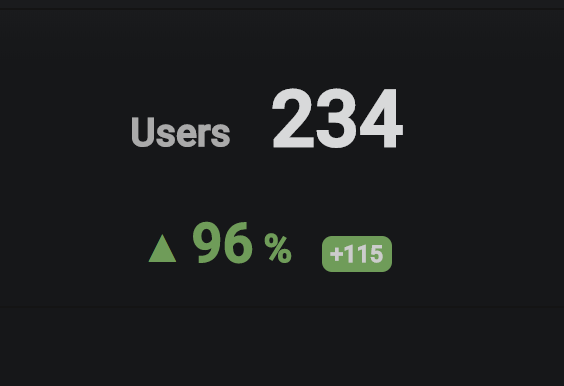

## Trend Panel Plugin for Grafana

The Trend Panel can show the current value of a metric and compare it to a previous time. It will also show the trend in percent and the difference of the two values:

## Status
This plugin is a fork of a partly-working and seemingly abandoned [Grafana plugin](https://github.com/buholzer/grafana-trend-panel). Work has been carried out to add features that TTD required as well as a number of small bug fixes.

## Attribution
- Originally forked from https://github.com/buholzer/grafana-trend-panel. Trend icon by ✦ Shmidt Sergey ✦ from the Noun Project